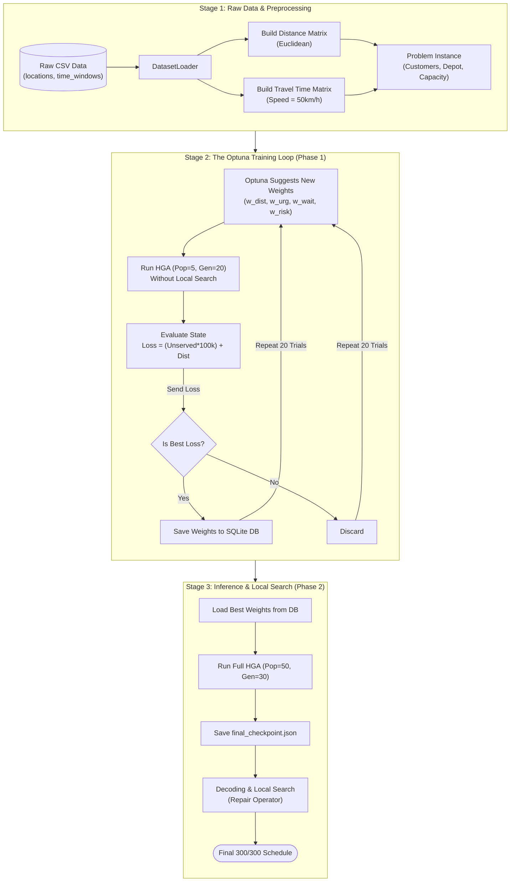

# SMART-TRAFFIC Data & Algorithm Lifecycle
========================================

This document describes the complete end-to-end data lifecycle and algorithmic pipeline used in the SMART-TRAFFIC delivery scheduling system. It covers everything from raw CSV ingestion to data preprocessing, the Bayesian-Optimized Memetic Algorithm (BOMA), and the continuous weight evaluation loop.

---

## 1. End-to-End System Architecture

---

## 2. Stage 1: Raw Data & Preprocessing

Before any algorithms run, the system must transform raw business data into mathematical structures that the algorithm can process in O(1) time.

1. **Raw Data Ingestion:** The system reads `locations.csv` (containing X, Y coordinates and service duration) and `time_windows.csv` (containing strict daily opening/closing hours for 7 days).
2. **Matrix Generation:**
   - **Distance Matrix:** Calculates the Euclidean distance between all nodes (DEPOT and 300 customers).
   - **Travel Time Matrix:** Converts distances into time based on the global `vehicle_speed` (default 50 km/h).
3. **Problem Instance:** The `DatasetLoader` bundles the parsed `Customer` objects, Depot, Time Windows, and matrices into a centralized `Problem` class. This allows the routing engine to fetch travel times instantly without recalculating formulas.

---

## 3. Stage 2: The Optuna Training Loop (Phase 1)

This phase acts as the "Brain" of the system. Instead of manually guessing which metric is most important (Distance vs. Urgency), we let Optuna's **Tree-structured Parzen Estimator (TPE)** find the mathematical truth.

1. **Initialization:** Optuna starts by suggesting a baseline Weight Vector (e.g., all 0.25).
2. **Algorithm Execution (Mini HGA):**
   - The system spins up a lightweight Genetic Algorithm (`Pop=5, Gen=20`).
   - We intentionally **turn off the Repair Operator (Local Search)**. This forces the HGA to rely entirely on the Optuna Weights to insert customers, exposing the raw, unfiltered performance of those weights.
3. **Weight Evaluation (Loss Function):**
   - After the miniature HGA finishes, the resulting state is evaluated:
     `Loss = (Unserved Customers × 100,000) + Total Distance (km)`
   - The massive penalty (`100,000`) forces Optuna to prioritize serving all customers above saving distance.
4. **Repeat & Refine:**
   - Optuna analyzes the Loss, adjusts the weights using Bayesian statistics, and suggests a new Vector.
   - This loop repeats for `N` trials (e.g., 20 or 50 times) until the absolute lowest Loss is found.
5. **Database Storage:** The `Best Weights` are permanently saved into the `Data_B/boma_two_phase.db` SQLite database.

---

## 4. Stage 3: Inference & Local Search (Phase 2)

Once the best weights are found, the Training loop ends. The system now transitions to creating the actual schedule.

1. **Global Search (HGA Evolution):**
   - A full-scale HGA (`Pop=50, Gen=30`) is launched.
   - The Decoder strictly uses the `Best Weights` from the Database to score and insert customers during Crossover and Mutation.
   - The absolute best evolutionary state is saved to `Data_B/final_checkpoint.json`.
2. **Inference (Real-time Generation):**
   - When operations request a schedule (via `generate_detailed_schedule.py`), the system loads the JSON checkpoint and the DB weights.
   - It decodes the sequence almost instantly (under 1 second).
3. **The Final Polish (Repair Operator):**
   - If the HGA leaves any tiny gaps (e.g., 3 unserved customers), the **Local Search (Ejection Pool)** is triggered **exactly ONE time**.
   - It forcefully ejects blocking customers, pushes the unserved ones in, and rearranges the timeline.
   - The result is a mathematically flawless `300/300` delivery schedule.
