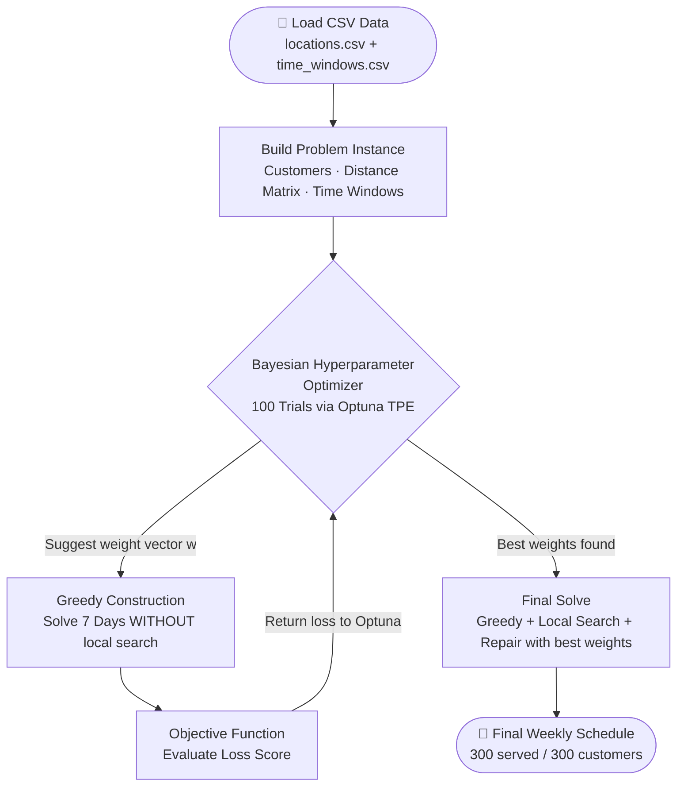
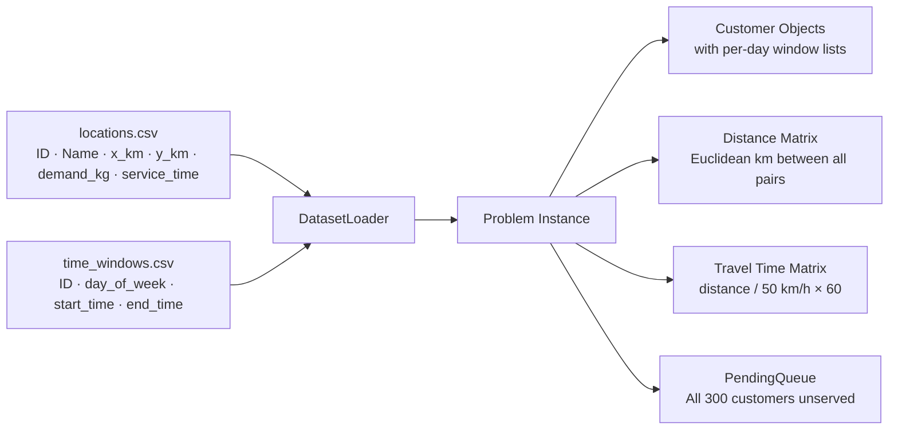
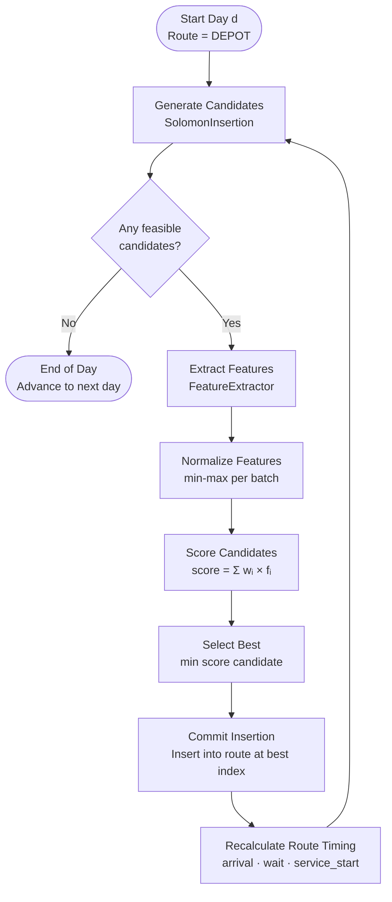
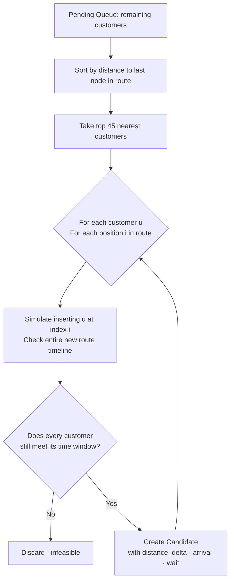
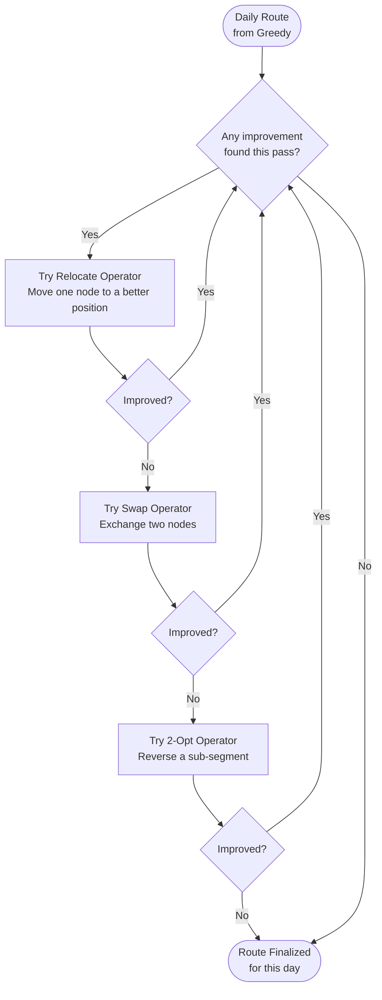
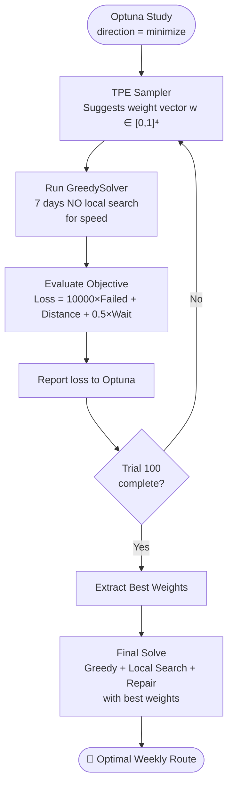
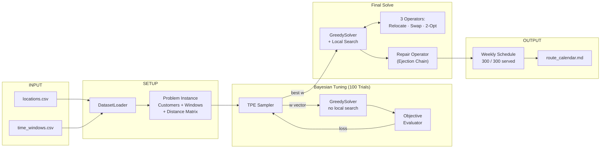

# SMART-TRAFFIC Algorithm Flow
==============================

This document describes the complete algorithmic pipeline used in the SMART-TRAFFIC delivery scheduling system, from raw CSV data to the final optimized weekly route.

---

## 1. High-Level System Overview



---

## 2. Data Loading & Problem Setup



**Key constants:**

| Parameter | Value |
|---|---|
| Speed limit | 50 km/h |
| Vehicle capacity | Effectively unlimited (≥ total demand) |
| Planning horizon | 7 days (Mon → Sun) |
| Penalty per unserved customer | 10,000 |

---

## 3. Greedy Construction Heuristic (Core Daily Solver)

Each day is solved using the **Solomon-style insertion heuristic**, which builds the route one customer at a time using a scored candidate pool.



### 3a. Candidate Generation — Solomon Insertion

For each greedy step, only the **45 closest pending customers** to the current last node in the route are evaluated (for speed). For each of those customers, **all valid insertion positions** in the current route are tested.



**Feasibility check** for an insertion at index `i`:
- Simulate travel time from predecessor → `u` → successor
- Check that `arrival ≤ window.end` for customer `u`
- Check that all subsequent customers in the route **still meet their windows** (cascade check)
- Check vehicle capacity not exceeded

### 3b. Feature Extraction

Four features are computed per candidate:

| Feature | Formula | Meaning |
|---|---|---|
| **Distance** | `d(prev, u) + d(u, next) − d(prev, next)` | Extra km added by inserting `u` |
| **Urgency** | `window_end − current_time` | How soon the window closes |
| **Waiting** | `max(0, window_start − arrival)` | Idle time if arriving early |
| **Delivery Risk** | `1 / (remaining_windows × days_left)` | Penalty risk if skipped today |

### 3c. Scoring

Features are **min-max normalized** across the current candidate batch, then combined into a single scalar score:

```
score = w_distance × f̂_distance
      + w_urgency  × f̂_urgency
      + w_waiting  × f̂_waiting
      + w_risk     × f̂_risk
```

The candidate with the **lowest score** is selected (greedy-minimum).

---

## 4. Local Search Improvement

After the greedy route for a day is built, **three neighbourhood operators** are applied in a loop until no further improvement is found (first-improvement strategy):



| Operator | What it does |
|---|---|
| **Relocate** | Removes one customer node and re-inserts it at every other position; keeps the best feasible move |
| **Swap** | Swaps two customer nodes; keeps the move if it reduces total travel time |
| **2-Opt** | Reverses a contiguous sub-sequence of the route; keeps the move if it reduces total travel time |

All moves are **feasibility-checked** — time windows must still be satisfied after every move.

## 4.5. Ejection Chain Repair Operator (End-of-Line Rescue)

If any customers remain unserved after Greedy + Local Search, a specialized **Ruin and Recreate** repair operator runs:

1. **Force Insertion**: Takes an unserved customer and forcefully inserts it into a valid day, disregarding subsequent window violations.
2. **Ejection**: Identifies all customers whose time windows are now violated and ejects them from the route.
3. **Re-insertion**: Attempts to greedily re-insert the ejected customers into other days in the schedule.
4. **Acceptance**: If all ejected customers find new homes without creating further violations, the entire chain of moves is accepted, successfully serving the previously stuck customer.

---

## 5. Bayesian Hyperparameter Optimization (Optuna TPE)

The four scoring weights `(w_distance, w_urgency, w_waiting, w_risk)` are automatically tuned using **Optuna's Tree-structured Parzen Estimator (TPE)** over 100 trials.



**Optimal weights discovered (100 trials):**

| Weight | Value |
|---|---|
| `w_distance` | 0.6987 |
| `w_urgency` | 0.5469 |
| `w_waiting` | 0.9447 |
| `w_delivery_risk` | 0.8038 |

---

## 6. Objective Function

The loss function used to evaluate any schedule:

```
Loss = (Failed Deliveries × 10,000) + Total Distance (km) + 0.5 × Total Waiting Time (min)
```

| Component | Weight | Meaning |
|---|---|---|
| **Failed deliveries** | ×10,000 | Strongly penalizes any unserved customer |
| **Total distance** | ×1 | Minimize fuel/time cost |
| **Total waiting time** | ×0.5 | Soft penalty for idle time at customers |

**Final scores achieved:**

| Method | Unserved | Loss Score |
|---|---|---|
| Nearest Neighbor Baseline | 115 | ~1,150,000+ |
| Earliest Deadline First | 15 | ~150,000+ |
| Proposed Heuristic (default weights) | 22 | ~223,000+ |
| Proposed Heuristic (Optuna weights) | 2 | 23,565.53 |
| **Proposed Heuristic + Repair Operator** | **0** | **3,665.82** |

---

## 7. Full End-to-End Pipeline Summary


