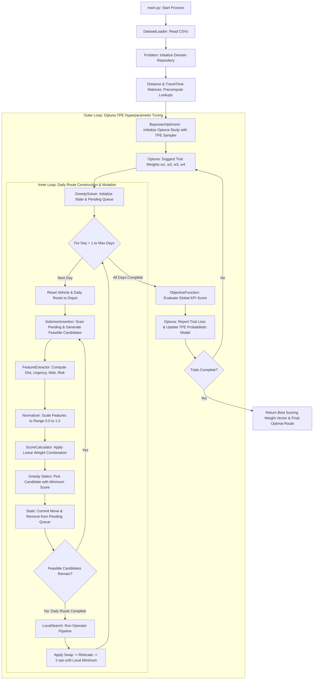
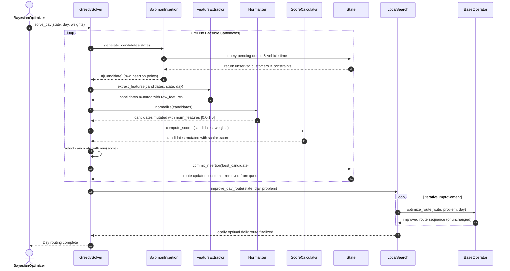
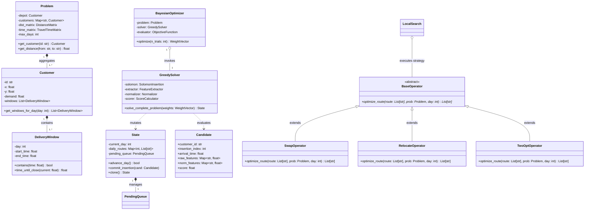

# VRPTW Enterprise Solver: System Architecture & Software Specification

> **Document Version:** 1.0.0
> **Author:** Lead Software Architect
> **Target Audience:** Automated Code Generation Engines (Antigravity IDE), Senior Backend Engineers, Optimization Specialists
> **System Scope:** Multi-Day, Multi-Window Vehicle Routing Problem with Time Windows (VRPTW) using Hybrid Heuristics and Bayesian Meta-Optimization.

---

## 1. Executive Summary & Architectural Philosophy

This specification defines the software architecture for an enterprise-grade Vehicle Routing Problem with Time Windows (VRPTW) solver. The problem domain encompasses approximately 300 customer orders distributed across multiple operational days, featuring a single central depot and customers requiring delivery within one or more specific time windows.

### 1.1 Core Architectural Principles

The system is built upon strict object-oriented design and modular separation of concerns. To prevent software entropy and ensure maintainability, the architecture enforces the following paradigms:

* **No God Classes:** Domain state, heuristic generation, candidate scoring, local search mutation, and hyperparameter optimization are rigidly isolated.
* **Strict Strategy Pattern:** All local search operators (Swap, Relocate, 2-opt) implement a unified interface, allowing runtime swapping without modifying the orchestrating engine.
* **Dependency Injection:** Evaluators, matrices, and configuration modules are injected into solvers rather than globally accessed or instantiated internally.
* **Pure Functional Scoring Mechanics:** Candidate evaluation is stateless and mathematically deterministic, decoupled from routing state mutations.

### 1.2 The Role of Bayesian Optimization

A critical architectural boundary in this system is the segregation of optimization layers:

```
+-------------------------------------------------------------------------+
|                        OUTER LOOP: META-OPTIMIZER                       |
|  +-------------------------------------------------------------------+  |
|  | Bayesian Optimization (Optuna / TPE Sampler)                      |  |
|  | * Proposes weight vectors: [w_dist, w_urg, w_wait, w_risk]        |  |
|  | * Evaluates global KPI objective: Failed, Distance, Waiting       |  |
|  +-------------------------------------------------------------------+  |
+-------------------------------------------------------------------------+
                                 |          ^
             Injects Weights     |          | Returns Global Objective
             (No Route Access)   |          | (Scalar Metric)
                                 v          |
+-------------------------------------------------------------------------+
|                        INNER LOOP: ROUTING ENGINE                       |
|  +-------------------------------------------------------------------+  |
|  | Daily Heuristic Construction & Mutation                           |  |
|  | * Solomon Insertion Heuristic (Candidate Generation)              |  |
|  | * Greedy Candidate Selection (Weighted Scoring)                   |  |
|  | * Local Search Trajectory Improvement (Swap, Relocate, 2-opt)     |  |
|  +-------------------------------------------------------------------+  |
+-------------------------------------------------------------------------+

```

> **CRITICAL ARCHITECTURAL DIRECTIVE:** > **Bayesian Optimization NEVER modifies routes, swaps customers, or alters vehicle trajectories directly.** Its sole domain is meta-optimization: learning the optimal continuous hyperparameter weights ($w_1, w_2, w_3, w_4$) that govern the inner-loop Greedy Selection heuristic. The inner loop executes deterministically for any given weight vector.

---

## 2. Comprehensive Directory Structure

The repository is structured to enforce strict architectural layers: data persistence, domain modeling, heuristic optimization, meta-optimization, and infrastructure utilities.

```
vrptw_solver/
│
├── config/
│   ├── __init__.py
│   ├── settings.py
│   └── weights_config.py
│
├── data/
│   ├── locations.csv
│   └── time_windows.csv
│
├── models/
│   ├── __init__.py
│   ├── customer.py
│   ├── delivery_window.py
│   ├── vehicle.py
│   ├── problem.py
│   ├── state.py
│   ├── candidate.py
│   └── pending_queue.py
│
├── preprocessing/
│   ├── __init__.py
│   ├── csv_loader.py
│   ├── dataset_loader.py
│   ├── distance_matrix.py
│   └── travel_time_matrix.py
│
├── solver/
│   ├── __init__.py
│   ├── feature_extractor.py
│   ├── normalizer.py
│   ├── score_calculator.py
│   ├── solomon_insertion.py
│   └── greedy_solver.py
│
├── optimizer/
│   ├── __init__.py
│   ├── objective_function.py
│   ├── bayesian_optimizer.py
│   ├── local_search.py
│   └── operators/
│       ├── __init__.py
│       ├── base_operator.py
│       ├── swap_operator.py
│       ├── relocate_operator.py
│       └── two_opt_operator.py
│
├── utils/
│   ├── __init__.py
│   ├── logger.py
│   └── validators.py
│
├── visualization/
│   ├── __init__.py
│   ├── route_plotter.py
│   └── convergence_plotter.py
│
├── tests/
│   ├── __init__.py
│   ├── test_models.py
│   ├── test_matrices.py
│   ├── test_solomon.py
│   ├── test_local_search.py
│   └── test_optuna_pipeline.py
│
├── requirements.txt
└── main.py

```

---

## 3. Detailed File Specifications

### 3.1 `config/settings.py`

* **Purpose:** Centralized system configuration, constants, and hyperparameters for physical routing constraints.
* **Responsibilities:** Stores default values for vehicle speed, depot coordinates, maximum planning days, and vehicle capacity limits.
* **Inputs/Outputs:** Loaded by startup scripts; outputs configuration data dataclasses.
* **Dependencies:** `dataclasses`, `typing`, `os`.
* **Public Methods:** `get_settings() -> SettingsConfig`.
* **Internal Methods:** `_validate_env_overrides()`.
* **Example Objects:** `SettingsConfig(max_days=5, vehicle_capacity=100.0, vehicle_speed=40.0)`.
* **Interactions:** Injected into `DatasetLoader`, `Problem`, and `GreedySolver`.

### 3.2 `config/weights_config.py`

* **Purpose:** Defines structures and bounds for scoring weights used during heuristic candidate selection.
* **Responsibilities:** Encapsulates weight boundaries for Optuna sampling and provides default fallback weights.
* **Inputs/Outputs:** Provides weight vector objects to the scoring and optimization modules.
* **Dependencies:** `dataclasses`, `typing`.
* **Public Methods:** `get_default_weights() -> WeightVector`, `get_weight_bounds() -> dict`.
* **Internal Methods:** None.
* **Example Objects:** `WeightVector(distance=0.3, urgency=0.4, waiting=0.2, delivery_risk=0.1)`.
* **Interactions:** Consumed by `ScoreCalculator` and `BayesianOptimizer`.

### 3.3 `models/customer.py`

* **Purpose:** Represents a physical customer entity requiring delivery.
* **Responsibilities:** Stores immutable customer identity, spatial coordinates, demand volume, and assigned time windows.
* **Inputs/Outputs:** Instantiated by loaders; queried by solvers and matrix generators.
* **Dependencies:** `typing`, `models.delivery_window.DeliveryWindow`.
* **Public Methods:** `get_windows_for_day(day: int) -> List[DeliveryWindow]`, `has_windows() -> bool`.
* **Internal Methods:** `_validate_demand()`.
* **Example Objects:** `Customer(id="C_101", x=45.5, y=-73.2, demand=15.0, windows=[...])`.
* **Interactions:** Aggregated within `Problem` and referenced by `Candidate` and `State`.

### 3.4 `models/delivery_window.py`

* **Purpose:** Defines a discrete, valid time interval on a specific operational day during which a customer can receive deliveries.
* **Responsibilities:** Enforces temporal window validity and calculates window duration and urgency metrics.
* **Inputs/Outputs:** Primitive time integers (minutes from midnight); outputs boolean checks for time feasibility.
* **Dependencies:** `dataclasses`.
* **Public Methods:** `contains(time: float) -> bool`, `duration() -> float`, `time_until_close(current_time: float) -> float`.
* **Internal Methods:** `_validate_window()`.
* **Example Objects:** `DeliveryWindow(day=1, start_time=480.0, end_time=600.0)`. # 08:00 to 10:00
* **Interactions:** Owned by `Customer`; evaluated by `SolomonInsertion` and `FeatureExtractor`.

### 3.5 `models/vehicle.py`

* **Purpose:** Models a delivery vehicle operating on a specific route for a given day.
* **Responsibilities:** Tracks current load, remaining capacity, assigned route sequence, and cumulative operational metrics.
* **Inputs/Outputs:** Accepts route assignments; outputs current capacity status and route timelines.
* **Dependencies:** `typing`, `models.customer.Customer`.
* **Public Methods:** `can_accommodate(demand: float) -> bool`, `add_stop(customer_id: str, arrival_time: float, wait_time: float, service_time: float)`, `reset()`.
* **Internal Methods:** `_update_load(demand: float)`.
* **Example Objects:** `Vehicle(id="V_01", capacity=100.0, current_load=45.0, route=["DEPOT", "C_101", "C_042"])`.
* **Interactions:** Managed by `State`; modified by `GreedySolver` and `LocalSearch`.

### 3.6 `models/problem.py`

* **Purpose:** Represents the immutable, complete domain definition of the VRPTW instance.
* **Responsibilities:** Acts as the single source of truth for all customers, the depot, delivery matrices, and operational boundaries.
* **Inputs/Outputs:** Constructed from raw dataset arrays and configuration; outputs lookup interfaces for domain entities.
* **Dependencies:** `typing`, `models.customer.Customer`, `preprocessing.distance_matrix.DistanceMatrix`, `preprocessing.travel_time_matrix.TravelTimeMatrix`.
* **Public Methods:** `get_customer(customer_id: str) -> Customer`, `get_all_customers() -> List[Customer]`, `get_depot() -> Customer`.
* **Internal Methods:** `_index_customers()`.
* **Example Objects:** `Problem(depot=Customer(...), customers={...}, max_days=3)`.
* **Interactions:** Injected into virtually every subsystem (`SolomonInsertion`, `ScoreCalculator`, `LocalSearch`).

### 3.7 `models/state.py`

* **Purpose:** Tracks the dynamic, mutable operational state of the solver during route construction across multiple days.
* **Responsibilities:** Maintains the current day, vehicle state, served customers, unserved pending queue, and current time horizon.
* **Inputs/Outputs:** Evaluated and mutated by insertion heuristics and local search operators.
* **Dependencies:** `typing`, `models.vehicle.Vehicle`, `models.pending_queue.PendingQueue`.
* **Public Methods:** `advance_day()`, `register_delivery(customer_id: str, day: int)`, `is_all_served() -> bool`, `clone() -> State`.
* **Internal Methods:** `_reconcile_pending_queue()`.
* **Example Objects:** `State(current_day=2, current_time=540.0, served_count=180, pending_queue=Queue(...))`.
* **Interactions:** Modified by `GreedySolver`; inspected by `ObjectiveFunction`.

### 3.8 `models/candidate.py`

* **Purpose:** Represents a potential insertion of a specific customer into a specific route position at a calculated timeline.
* **Responsibilities:** Holds raw feature data, normalized feature values, and the calculated weighted score for comparison.
* **Inputs/Outputs:** Produced by `SolomonInsertion`; enriched by `FeatureExtractor` and `Normalizer`; consumed by `GreedySolver`.
* **Dependencies:** `dataclasses`, `models.delivery_window.DeliveryWindow`.
* **Public Methods:** `set_normalized_features(features: dict)`, `set_score(score: float)`.
* **Internal Methods:** None.
* **Example Objects:** `Candidate(customer_id="C_088", insertion_index=3, arrival_time=510.0, wait_time=10.0, cost_distance=12.4, score=0.215)`.
* **Interactions:** Created in `SolomonInsertion`, evaluated in `ScoreCalculator`, selected in `GreedySolver`.

### 3.9 `models/pending_queue.py`

* **Purpose:** Manages the collection of customer orders that remain unvisited across the planning horizon.
* **Responsibilities:** Filters unserved customers by daily window availability, tracks failed delivery risks, and updates upon state changes.
* **Inputs/Outputs:** Receives service notifications; outputs lists of eligible customer IDs for a target operational day.
* **Dependencies:** `typing`, `models.customer.Customer`.
* **Public Methods:** `get_pending_for_day(day: int) -> List[str]`, `remove(customer_id: str)`, `get_unserved_count() -> int`, `get_all_pending() -> List[str]`.
* **Internal Methods:** `_sort_by_urgency()`.
* **Example Objects:** `PendingQueue(unserved_ids={"C_001", "C_002", ...})`.
* **Interactions:** Owned by `State`; queried by `SolomonInsertion` to determine candidate generation scope.

### 3.10 `preprocessing/csv_loader.py`

* **Purpose:** Handles low-level file system I/O and tabular string parsing for dataset files.
* **Responsibilities:** Reads CSV files, validates structural schema, strips whitespace, and handles missing or malformed values.
* **Inputs/Outputs:** Inputs file paths; outputs raw lists of dictionaries or pandas DataFrames.
* **Dependencies:** `csv`, `typing`, `os`, `utils.validators`.
* **Public Methods:** `load_locations(filepath: str) -> List[dict]`, `load_time_windows(filepath: str) -> List[dict]`.
* **Internal Methods:** `_verify_headers(row: dict, expected: List[str])`, `_safe_float_convert(val: str) -> float`.
* **Example Objects:** N/A (Stateless functional service or singleton).
* **Interactions:** Called exclusively by `DatasetLoader`.

### 3.11 `preprocessing/dataset_loader.py`

* **Purpose:** Orchestrates the transformation of raw tabular data into structured domain entities (`Customer`, `DeliveryWindow`).
* **Responsibilities:** Correlates location records with time window records, identifies the depot, and instantiates the `Problem` object.
* **Inputs/Outputs:** Uses `CSVLoader` outputs; outputs a fully initialized `Problem` instance.
* **Dependencies:** `typing`, `preprocessing.csv_loader.CSVLoader`, `models.problem.Problem`, `models.customer.Customer`, `models.delivery_window.DeliveryWindow`.
* **Public Methods:** `build_problem_instance(locations_path: str, windows_path: str) -> Problem`.
* **Internal Methods:** `_map_windows_to_customers(raw_windows: List[dict]) -> dict`, `_extract_depot(raw_locations: List[dict]) -> Customer`.
* **Example Objects:** `DatasetLoader(csv_loader=CSVLoader())`.
* **Interactions:** Executed in `main.py` and `test_optuna_pipeline.py` during system initialization.

### 3.12 `preprocessing/distance_matrix.py`

* **Purpose:** Provides O(1) lookup speed for spatial distances between any two coordinate entities (Depot or Customers).
* **Responsibilities:** Computes Euclidean or Manhattan distance matrices upon initialization and stores them in optimized memory structures.
* **Inputs/Outputs:** Inputs a list of spatial coordinates; outputs scalar distance values.
* **Dependencies:** `math`, `typing`, `models.customer.Customer`.
* **Public Methods:** `get_distance(from_id: str, to_id: str) -> float`, `get_matrix() -> List[List[float]]`.
* **Internal Methods:** `_compute_euclidean(x1: float, y1: float, x2: float, y2: float) -> float`.
* **Example Objects:** `DistanceMatrix(matrix=[[0.0, 12.5], [12.5, 0.0]], index_map={"DEPOT": 0, "C_001": 1})`.
* **Interactions:** Embedded within `Problem`; queried continuously by `SolomonInsertion` and `LocalSearch`.

### 3.13 `preprocessing/travel_time_matrix.py`

* **Purpose:** Provides O(1) lookup speed for temporal transit times between any two nodes.
* **Responsibilities:** Calculates travel durations based on spatial distance and vehicle speed profiles, accounting for service times.
* **Inputs/Outputs:** Inputs node identifiers; outputs transit durations in minutes.
* **Dependencies:** `typing`, `preprocessing.distance_matrix.DistanceMatrix`, `config.settings.SettingsConfig`.
* **Public Methods:** `get_travel_time(from_id: str, to_id: str) -> float`, `get_service_time(customer_id: str) -> float`.
* **Internal Methods:** `_apply_speed_factor(distance: float) -> float`.
* **Example Objects:** `TravelTimeMatrix(speed_kmh=40.0, matrix=[...])`.
* **Interactions:** Embedded within `Problem`; queried by `SolomonInsertion` for window feasibility validation.

### 3.14 `solver/solomon_insertion.py`

* **Purpose:** Implements the Solomon I1 heuristic for generating feasible insertion candidates into an existing vehicle route.
* **Responsibilities:** Scans all unserved customers in the pending queue, identifies all feasible insertion positions in the current route without violating time or capacity constraints, and generates raw `Candidate` instances.
* **Inputs/Outputs:** Inputs current `State` and `Problem`; outputs `List[Candidate]`.
* **Dependencies:** `typing`, `models.problem.Problem`, `models.state.State`, `models.candidate.Candidate`.
* **Public Methods:** `generate_candidates(state: State, day: int) -> List[Candidate]`.
* **Internal Methods:** `_evaluate_insertion(customer: Customer, route: List[str], index: int, state: State) -> Optional[Candidate]`, `_check_time_feasibility(...) -> bool`.
* **Example Objects:** `SolomonInsertion(problem=problem_instance, c1=1.0, c2=1.0)`.
* **Interactions:** Invoked by `GreedySolver` at each route-building step.

### 3.15 `solver/feature_extractor.py`

* **Purpose:** Extracts multidimensional heuristic metrics from raw `Candidate` objects to prepare them for multi-objective scoring.
* **Responsibilities:** Calculates Distance Cost, Urgency Metric, Incurred Waiting Time, and Delivery Risk for each generated candidate.
* **Inputs/Outputs:** Inputs `List[Candidate]`; mutates candidates by populating their raw feature dictionaries.
* **Dependencies:** `typing`, `models.problem.Problem`, `models.candidate.Candidate`.
* **Public Methods:** `extract_features(candidates: List[Candidate], state: State, day: int)`.
* **Internal Methods:** `_compute_urgency(customer: Customer, day: int, current_time: float) -> float`, `_compute_delivery_risk(customer: Customer, current_day: int, max_days: int) -> float`.
* **Example Objects:** `FeatureExtractor(problem=problem_instance)`.
* **Interactions:** Called by `GreedySolver` immediately after candidate generation.

### 3.16 `solver/normalizer.py`

* **Purpose:** Standardizes raw candidate features onto a uniform $[0, 1]$ numerical scale to prevent scalar dominance during weighted linear combination.
* **Responsibilities:** Applies Min-Max normalization across a pool of candidates for each feature dimension; handles edge cases where zero variance exists.
* **Inputs/Outputs:** Inputs `List[Candidate]`; mutates candidates by populating their normalized feature dictionaries.
* **Dependencies:** `typing`, `models.candidate.Candidate`.
* **Public Methods:** `normalize(candidates: List[Candidate])`.
* **Internal Methods:** `_min_max_scale(val: float, min_val: float, max_val: float) -> float`.
* **Example Objects:** `Normalizer(epsilon=1e-6)`.
* **Interactions:** Called by `GreedySolver` after feature extraction and before score calculation.

### 3.17 `solver/score_calculator.py`

* **Purpose:** Computes the deterministic, weighted scalar score for normalized candidates using Optuna-provided weights.
* **Responsibilities:** Evaluates the linear combination formula, enforcing minimization semantics where lower scores represent superior candidate selections.
* **Inputs/Outputs:** Inputs `List[Candidate]` and `WeightVector`; mutates candidates by setting their `.score` attribute.
* **Dependencies:** `typing`, `models.candidate.Candidate`, `config.weights_config.WeightVector`.
* **Public Methods:** `compute_scores(candidates: List[Candidate], weights: WeightVector)`.
* **Internal Methods:** `_apply_linear_combination(cand: Candidate, w: WeightVector) -> float`.
* **Example Objects:** `ScoreCalculator()`.
* **Interactions:** Injected into `GreedySolver`; bridges Optuna hyperparameter weights to inner-loop routing decisions.

### 3.18 `solver/greedy_solver.py`

* **Purpose:** Orchestrates the daily heuristic route construction loop.
* **Responsibilities:** Iterates through delivery days, initializes vehicles, commands candidate generation, extraction, normalization, scoring, and selects the lowest-scoring candidate to mutate the system state until no feasible moves remain.
* **Inputs/Outputs:** Inputs `Problem` and `WeightVector`; outputs completed daily vehicle routes within the updated `State`.
* **Dependencies:** `typing`, `models.problem.Problem`, `models.state.State`, `solver.solomon_insertion.SolomonInsertion`, `solver.feature_extractor.FeatureExtractor`, `solver.normalizer.Normalizer`, `solver.score_calculator.ScoreCalculator`.
* **Public Methods:** `solve_day(state: State, day: int, weights: WeightVector) -> State`, `solve_complete_problem(weights: WeightVector) -> State`.
* **Internal Methods:** `_select_best_candidate(candidates: List[Candidate]) -> Candidate`, `_apply_candidate(state: State, candidate: Candidate)`.
* **Example Objects:** `GreedySolver(problem=p, solomon=s, extractor=f, normalizer=n, scorer=sc)`.
* **Interactions:** Core engine called by `BayesianOptimizer` during each optimization trial.

### 3.19 `optimizer/operators/base_operator.py`

* **Purpose:** Abstract Base Class (ABC) defining the contract for all local search trajectory mutation operators.
* **Responsibilities:** Enforces standard method signatures for route neighborhood generation and delta-cost evaluation without mutating state prematurely.
* **Inputs/Outputs:** Inputs a vehicle route and problem matrices; outputs improved route sequences or `None` if no local improvement exists.
* **Dependencies:** `abc`, `typing`, `models.problem.Problem`.
* **Public Methods:** `@abstractmethod optimize_route(route: List[str], problem: Problem, day: int) -> List[str]`.
* **Internal Methods:** `_validate_route_constraints(route: List[str], problem: Problem, day: int) -> bool`.
* **Example Objects:** N/A (Abstract Interface).
* **Interactions:** Implemented by `SwapOperator`, `RelocateOperator`, and `TwoOptOperator`; consumed by `LocalSearch`.

### 3.20 `optimizer/operators/swap_operator.py`

* **Purpose:** Implements the intra-route node swap neighborhood operator.
* **Responsibilities:** Iterates over all pairs of customer nodes within a daily route, exchanges their positions, checks time/capacity feasibility, and commits the swap if it reduces total travel distance.
* **Inputs/Outputs:** Inputs raw route list; outputs optimized route list.
* **Dependencies:** `typing`, `optimizer.operators.base_operator.BaseOperator`, `models.problem.Problem`.
* **Public Methods:** `optimize_route(route: List[str], problem: Problem, day: int) -> List[str]`.
* **Internal Methods:** `_evaluate_swap_gain(route: List[str], i: int, j: int, problem: Problem) -> float`.
* **Example Objects:** `SwapOperator()`.
* **Interactions:** Injected into `LocalSearch` as part of the strategy pipeline.

### 3.21 `optimizer/operators/relocate_operator.py`

* **Purpose:** Implements the intra-route node relocation (insertion) neighborhood operator.
* **Responsibilities:** Removes a customer node from its current index and inserts it into every other possible index in the route, retaining the change that yields the greatest distance reduction while maintaining window feasibility.
* **Inputs/Outputs:** Inputs raw route list; outputs optimized route list.
* **Dependencies:** `typing`, `optimizer.operators.base_operator.BaseOperator`, `models.problem.Problem`.
* **Public Methods:** `optimize_route(route: List[str], problem: Problem, day: int) -> List[str]`.
* **Internal Methods:** `_evaluate_relocate_gain(route: List[str], from_idx: int, to_idx: int, problem: Problem) -> float`.
* **Example Objects:** `RelocateOperator()`.
* **Interactions:** Injected into `LocalSearch`.

### 3.22 `optimizer/operators/two_opt_operator.py`

* **Purpose:** Implements the 2-opt edge exchange trajectory reversal operator to untangle route crossovers.
* **Responsibilities:** Selects two non-adjacent edges, removes them, and reconnects the endpoints by reversing the sub-tour between them, verifying that time window causality is preserved in the reversed sequence.
* **Inputs/Outputs:** Inputs raw route list; outputs optimized route list.
* **Dependencies:** `typing`, `optimizer.operators.base_operator.BaseOperator`, `models.problem.Problem`.
* **Public Methods:** `optimize_route(route: List[str], problem: Problem, day: int) -> List[str]`.
* **Internal Methods:** `_reverse_subtour(route: List[str], i: int, j: int) -> List[str]`, `_verify_reversed_windows(...) -> bool`.
* **Example Objects:** `TwoOptOperator()`.
* **Interactions:** Injected into `LocalSearch`.

### 3.23 `optimizer/local_search.py`

* **Purpose:** Orchestrates the local search improvement phase using configured neighborhood operators.
* **Responsibilities:** Executes after the greedy construction of each day's route; iteratively applies operator strategies until a local minimum (no further improvements possible) is reached.
* **Inputs/Outputs:** Inputs a newly constructed daily `State` route; mutates the route in-place with optimized sequences.
* **Dependencies:** `typing`, `models.state.State`, `models.problem.Problem`, `optimizer.operators.base_operator.BaseOperator`.
* **Public Methods:** `improve_day_route(state: State, day: int, problem: Problem) -> State`.
* **Internal Methods:** `_run_operator_pipeline(route: List[str], problem: Problem, day: int) -> Tuple[List[str], bool]`.
* **Example Objects:** `LocalSearch(operators=[RelocateOperator(), SwapOperator(), TwoOptOperator()])`.
* **Interactions:** Called by `GreedySolver` at the end of each operational day.

### 3.24 `optimizer/objective_function.py`

* **Purpose:** Evaluates the ultimate mathematical quality of a fully completed multi-day routing schedule.
* **Responsibilities:** Aggregates global system metrics—specifically Failed Deliveries (unserved customers), Total Route Distance across all days, and Cumulative Waiting Time—into a single scalar loss value for Optuna.
* **Inputs/Outputs:** Inputs completed `State` and `Problem`; outputs a single float value representing global cost.
* **Dependencies:** `typing`, `models.state.State`, `models.problem.Problem`.
* **Public Methods:** `evaluate(state: State, problem: Problem) -> float`.
* **Internal Methods:** `_calculate_total_distance(state: State, problem: Problem) -> float`, `_calculate_total_waiting(state: State, problem: Problem) -> float`, `_count_failed_deliveries(state: State) -> int`.
* **Example Objects:** `ObjectiveFunction(penalty_unserved=10000.0, weight_distance=1.0, weight_waiting=0.5)`.
* **Interactions:** Executed by `BayesianOptimizer` inside the Optuna evaluation callback.

### 3.25 `optimizer/bayesian_optimizer.py`

* **Purpose:** Manages the Optuna meta-optimization lifecycle using Tree-structured Parzen Estimators (TPE).
* **Responsibilities:** Defines hyperparameter search spaces, instantiates the Optuna study, runs evaluation trials that execute the complete inner-loop solver, and logs convergence history.
* **Inputs/Outputs:** Inputs `Problem` and configuration settings; outputs the optimal `WeightVector` and optimization logs.
* **Dependencies:** `optuna`, `typing`, `models.problem.Problem`, `solver.greedy_solver.GreedySolver`, `optimizer.objective_function.ObjectiveFunction`, `config.weights_config.WeightVector`.
* **Public Methods:** `optimize(n_trials: int = 100) -> WeightVector`, `get_best_objective() -> float`, `get_study() -> optuna.study.Study`.
* **Internal Methods:** `_objective_wrapper(trial: optuna.trial.Trial) -> float`.
* **Example Objects:** `BayesianOptimizer(problem=problem_instance, solver=greedy_solver, evaluator=objective_func)`.
* **Interactions:** Top-level controller invoked by `main.py`.

---

## 4. Deep-Dive Class Specifications & Interfaces

Below are the programmatic interfaces and architectural contracts for the critical domain classes. Code snippets contain **only signatures, type hints, and docstrings**—no implementation logic.

### 4.1 Domain Modeling Classes

#### `Problem`

```python
from typing import List, Dict, Optional
from models.customer import Customer
from preprocessing.distance_matrix import DistanceMatrix
from preprocessing.travel_time_matrix import TravelTimeMatrix

class Problem:
    """
    Immutable domain repository representing the complete VRPTW instance.
    Acts as the central registry for spatial, temporal, and entity data.
    """
    def __init__(
        self,
        depot: Customer,
        customers: Dict[str, Customer],
        distance_matrix: DistanceMatrix,
        travel_time_matrix: TravelTimeMatrix,
        max_days: int,
        vehicle_capacity: float
    ):
        self._depot: Customer = depot
        self._customers: Dict[str, Customer] = customers
        self._distance_matrix: DistanceMatrix = distance_matrix
        self._travel_time_matrix: TravelTimeMatrix = travel_time_matrix
        self._max_days: int = max_days
        self._vehicle_capacity: float = vehicle_capacity

    def get_customer(self, customer_id: str) -> Customer:
        """Retrieves a customer entity by its unique identifier."""
        pass

    def get_all_customers(self) -> List[Customer]:
        """Returns a list of all non-depot customer entities."""
        pass

    def get_depot(self) -> Customer:
        """Returns the central depot entity."""
        pass

    def get_distance(self, from_id: str, to_id: str) -> float:
        """Delegates spatial distance lookup to the internal matrix."""
        pass

    def get_travel_time(self, from_id: str, to_id: str) -> float:
        """Delegates temporal transit lookup to the internal matrix."""
        pass

    @property
    def max_days(self) -> int:
        """Total operational planning days in the horizon."""
        pass

    @property
    def vehicle_capacity(self) -> float:
        """Maximum physical load capacity per delivery vehicle."""
        pass

```

#### `Customer` & `DeliveryWindow`

```python
from typing import List
from dataclasses import dataclass

@dataclass(frozen=True)
class DeliveryWindow:
    """Represents a discrete temporal interval on an operational day."""
    day: int
    start_time: float  # Minutes from midnight (e.g., 480.0 for 08:00)
    end_time: float    # Minutes from midnight (e.g., 720.0 for 12:00)

    def contains(self, time: float) -> bool:
        """Checks if a given timestamp falls within [start_time, end_time]."""
        pass

    def time_until_close(self, current_time: float) -> float:
        """Returns remaining time until window closes; negative if expired."""
        pass

class Customer:
    """Represents a physical client location with demand and time constraints."""
    def __init__(
        self,
        customer_id: str,
        x_coord: float,
        y_coord: float,
        demand: float,
        service_duration: float,
        windows: List[DeliveryWindow]
    ):
        self._id: str = customer_id
        self._x: float = x_coord
        self._y: float = y_coord
        self._demand: float = demand
        self._service_duration: float = service_duration
        self._windows: List[DeliveryWindow] = windows

    @property
    def id(self) -> str:
        pass

    @property
    def demand(self) -> float:
        pass

    @property
    def service_duration(self) -> float:
        pass

    def get_windows_for_day(self, day: int) -> List[DeliveryWindow]:
        """Returns all delivery windows scheduled for a specific operational day."""
        pass

    def get_all_windows(self) -> List[DeliveryWindow]:
        """Returns the complete sequence of delivery windows across all days."""
        pass

```

---

### 4.2 Dynamic State & Queue Classes

#### `State` & `PendingQueue`

```python
from typing import List, Dict, Set, Optional
from models.vehicle import Vehicle

class PendingQueue:
    """Manages unserved customer IDs across the multi-day planning horizon."""
    def __init__(self, initial_customer_ids: Set[str]):
        self._unserved: Set[str] = initial_customer_ids

    def remove(self, customer_id: str) -> None:
        """Removes a customer from the pending queue upon successful service."""
        pass

    def get_pending(self) -> Set[str]:
        """Returns a copy of all currently unserved customer IDs."""
        pass

    def is_empty(self) -> bool:
        """Returns True if all customers have been assigned deliveries."""
        pass

class State:
    """
    Mutable state object tracking routing execution across operational days.
    Encapsulates daily vehicle trajectories, current timing, and service queues.
    """
    def __init__(self, pending_queue: PendingQueue, max_days: int):
        self._pending_queue: PendingQueue = pending_queue
        self._max_days: int = max_days
        self._current_day: int = 1
        self._current_time: float = 0.0
        self._daily_routes: Dict[int, List[str]] = {day: ["DEPOT"] for day in range(1, max_days + 1)}
        self._daily_arrival_times: Dict[int, Dict[str, float]] = {day: {} for day in range(1, max_days + 1)}
        self._daily_wait_times: Dict[int, Dict[str, float]] = {day: {} for day in range(1, max_days + 1)}

    def current_day(self) -> int:
        pass

    def current_route(self) -> List[str]:
        """Returns the sequence of customer IDs for the current operational day."""
        pass

    def advance_day(self) -> bool:
        """Transitions state to the next operational day. Returns False if horizon reached."""
        pass

    def commit_insertion(self, customer_id: str, index: int, arrival: float, wait: float) -> None:
        """Mutates current daily route by inserting a customer at the specified sequence index."""
        pass

    def get_completed_routes(self) -> Dict[int, List[str]]:
        """Returns full multi-day routing schedule."""
        pass

    def clone(self) -> 'State':
        """Creates a deep copy of the state for non-destructive heuristic evaluation."""
        pass

```

---

### 4.3 Heuristic Engine Classes

#### `Candidate`, `SolomonInsertion`, & `ScoreCalculator`

```python
from dataclasses import dataclass, field
from typing import List, Dict, Any, Optional
from config.weights_config import WeightVector

@dataclass
class Candidate:
    """Represents a evaluated, feasible insertion move within the routing heuristic."""
    customer_id: str
    day: int
    insertion_index: int
    arrival_time: float
    wait_time: float
    service_start_time: float
    distance_delta: float
    
    # Raw extracted features
    raw_features: Dict[str, float] = field(default_factory=dict)
    # Normalized features [0.0 - 1.0]
    norm_features: Dict[str, float] = field(default_factory=dict)
    # Weighted composite scalar score
    score: float = float('inf')

class SolomonInsertion:
    """Implements Solomon I1 candidate generation logic for route construction."""
    def __init__(self, problem: 'Problem'):
        self._problem = problem

    def generate_candidates(self, state: 'State') -> List[Candidate]:
        """Scans pending queue and generates all feasible insertion candidates for current day."""
        pass

class ScoreCalculator:
    """Applies Optuna weight vectors to normalized candidates to establish greedy ranking."""
    def compute_scores(self, candidates: List[Candidate], weights: WeightVector) -> None:
        """Mutates candidate objects by computing linear combination of normalized features."""
        pass

```

---

### 4.4 Local Search Strategy Classes

#### `BaseOperator` & Implementations

```python
from abc import ABC, abstractmethod
from typing import List

class BaseOperator(ABC):
    """Abstract Strategy Interface for local search trajectory improvement operators."""
    @abstractmethod
    def optimize_route(self, route: List[str], problem: 'Problem', day: int) -> List[str]:
        """
        Evaluates neighborhood mutations for the provided route sequence.
        Returns an improved route sequence, or the original sequence if locally optimal.
        """
        pass

class SwapOperator(BaseOperator):
    """Intra-route exchange operator swapping non-adjacent node positions."""
    def optimize_route(self, route: List[str], problem: 'Problem', day: int) -> List[str]:
        pass

class RelocateOperator(BaseOperator):
    """Intra-route insertion operator moving a single node to an optimal sequence index."""
    def optimize_route(self, route: List[str], problem: 'Problem', day: int) -> List[str]:
        pass

class TwoOptOperator(BaseOperator):
    """Edge-reversal operator eliminating intersecting paths within a daily route."""
    def optimize_route(self, route: List[str], problem: 'Problem', day: int) -> List[str]:
        pass

```

---

### 4.5 Meta-Optimization Classes

#### `ObjectiveFunction` & `BayesianOptimizer`

```python
import optuna
from typing import Dict, Any

class ObjectiveFunction:
    """Evaluates multi-day routing state against global KPI objectives for Optuna feedback."""
    def __init__(self, unserved_penalty: float = 10000.0):
        self._penalty = unserved_penalty

    def evaluate(self, state: 'State', problem: 'Problem') -> float:
        """
        Computes scalar loss:
        Loss = (Failed Deliveries * penalty) + Total Distance + Total Waiting Time
        """
        pass

class BayesianOptimizer:
    """Meta-optimization controller utilizing Optuna TPE sampler to tune scoring weights."""
    def __init__(
        self,
        problem: 'Problem',
        solver: 'GreedySolver',
        objective_evaluator: ObjectiveFunction
    ):
        self._problem = problem
        self._solver = solver
        self._evaluator = objective_evaluator
        self._study: Optional[optuna.study.Study] = None

    def optimize(self, n_trials: int = 100) -> Dict[str, float]:
        """Executes TPE optimization loop, returning best hyperparameter weight dictionary."""
        pass

```

---

## 5. Execution Flow & Architecture Diagrams

### 5.1 Main System Orchestration Pipeline

The following Mermaid diagram illustrates the end-to-end operational execution flow from process invocation through Bayesian optimization convergence.



### 5.2 Inner-Loop Sequence Diagram

The sequence diagram below maps the runtime object interactions occurring within a single operational day during greedy candidate selection and subsequent trajectory improvement.



---

## 6. Unified Modeling Language (UML) Architecture Diagrams

### 6.1 Comprehensive Class Diagram

The structure below delineates class relationships, inheritance hierarchies, and compositional dependencies across the system.



### 6.2 Package Architecture Diagram

This diagram illustrates the high-level boundaries and dependencies between modules, verifying that meta-optimization cannot directly bypass the heuristic solver interface.

```mermaid
graph TD
    subgraph Package_Config [config]
        CFG[settings / weights_config]
    end

    subgraph Package_Models [models]
        MOD[Customer / State / Candidate / Problem]
    end

    subgraph Package_Preprocessing [preprocessing]
        PRE[DatasetLoader / Matrices / CSVLoader]
    end

    subgraph Package_Solver [solver]
        SLV[GreedySolver / Solomon / Scorer / Normalizer]
    end

    subgraph Package_Optimizer [optimizer]
        OPT[BayesianOptimizer / LocalSearch / ObjectiveFunction]
        subgraph Operators [operators]
            OPS[Swap / Relocate / 2-Opt]
        </subgraph>
    end

    PRE --> MOD
    PRE --> CFG
    SLV --> MOD
    SLV --> CFG
    OPT --> SLV
    OPT --> MOD
    OPT --> CFG
    OPS --> MOD

```

---

## 7. State Management & Lifecycle Transitions

The system state (`State`) undergoes continuous transformations during the execution lifecycle. The table below outlines the state before and after a **Single Customer Insertion Move** and a **Day Transition**.

### 7.1 Single Heuristic Move Transition

Suppose the vehicle is currently at `C_005` at time $t = 500.0$ min on Day 1. The `GreedySolver` selects `Candidate(customer_id="C_012", index=2, arrival=530.0, wait=0.0)`.

| State Attribute | BEFORE Move Execution | AFTER Move Execution |
| --- | --- | --- |
| **Current Location** | Node `C_005` | Node `C_012` |
| **Current Time ($t$)** | `500.0` minutes | `550.0` minutes (Arrival `530.0` + Service `20.0`) |
| **Current Day** | Day `1` | Day `1` (Unchanged) |
| **Served Customers Count** | `42` customers | `43` customers |
| **Pending Queue Size** | `258` customers | `257` customers (`C_012` removed) |
| **Active Daily Route** | `["DEPOT", "C_005"]` | `["DEPOT", "C_005", "C_012"]` |
| **Vehicle Load** | `35.0` / `100.0` units | `50.0` / `100.0` units (Demand of `C_012` = `15.0`) |

### 7.2 Day Transition Lifecycle

When no feasible insertion candidates remain for Day 1 (due to time horizon exhaustion or vehicle capacity limits), the system advances to Day 2.

| State Attribute | BEFORE Day Advance (End of Day 1) | AFTER Day Advance (Start of Day 2) |
| --- | --- | --- |
| **Current Location** | Node `C_089` | Node `DEPOT` |
| **Current Time ($t$)** | `685.0` minutes | `0.0` minutes (Reset for new operational day) |
| **Current Day** | Day `1` | Day `2` |
| **Served Customers Count** | `65` customers | `65` customers (Unchanged across boundary) |
| **Pending Queue Size** | `235` customers | `235` customers (Unchanged across boundary) |
| **Active Daily Route** | `["DEPOT", ..., "C_089", "DEPOT"]` | `["DEPOT"]` (New active sequence initialized) |
| **Vehicle Load** | `98.0` / `100.0` units | `0.0` / `100.0` units (Vehicle capacity replenished) |

---

## 8. Mathematical Scoring & Heuristic Mechanics

### 8.1 Solomon Insertion Heuristic (I1) Foundations

For a candidate customer $u$ being evaluated for insertion between adjacent route nodes $i$ and $j$, the spatial and temporal insertion cost $c(i, u, j)$ is computed using the Solomon I1 formulation:

$$c(i, u, j) = \alpha_1 \cdot c_1(i, u, j) + \alpha_2 \cdot c_2(i, u, j)$$

Where $c_1(i, u, j)$ is the **distance insertion detour**:

$$c_1(i, u, j) = d_{i,u} + d_{u,j} - \mu \cdot d_{i,j}$$

And $c_2(i, u, j)$ is the **delay in service time** induced at node $j$:

$$c_2(i, u, j) = b_{j}^{\text{new}} - b_{j}^{\text{old}}$$

*(Here, $d_{x,y}$ represents spatial distance, $\mu$ is the route savings parameter typically set to $1.0$, and $b_j$ represents the arrival timestamp at node $j$).*

### 8.2 Multi-Objective Feature Extraction & Normalization

Once the Solomon insertion identifies all structurally feasible candidate insertions $C = \{c_1, c_2, \dots, c_k\}$, four distinct raw features are calculated for each candidate $c \in C$:

1. **Distance Cost ($f_{\text{dist}}$):** The spatial detour $c_1(i, u, j)$.
2. **Urgency ($f_{\text{urg}}$):** Time remaining until customer $u$'s delivery window closes on the current day:
$$f_{\text{urg}}(u) = \text{WindowEnd}_u - \text{CurrentTime}$$


*(Note: Smaller values denote higher urgency. A customer whose window closes in 10 minutes is more critical than one closing in 200 minutes).*
3. **Waiting Time ($f_{\text{wait}}$):** Vehicle idle time if it arrives at node $u$ prior to window opening:
$$f_{\text{wait}}(u) = \max(0, \, \text{WindowStart}_u - \text{ArrivalTime}_u)$$


4. **Delivery Risk ($f_{\text{risk}}$):** A metric quantifying the probability of delivery failure if customer $u$ is postponed to a future day:
$$f_{\text{risk}}(u) = \frac{1}{\text{RemainingWindowsCount}(u) \cdot (\text{MaxDays} - \text{CurrentDay} + 1)}$$


*(Customers with only one valid delivery window on the final planning day exhibit maximum risk).*

#### Min-Max Normalization Math

To prevent scalar dominance, each feature dimension $f \in \{f_{\text{dist}}, f_{\text{urg}}, f_{\text{wait}}, f_{\text{risk}}\}$ is normalized across the active candidate pool $C$ to produce $\hat{f} \in [0, 1]$. Because the greedy selector minimizes candidate scores, orientation must be preserved: **0.0 must always represent the most desirable state**.

For **Distance, Waiting Time, and Delivery Risk** (where lower raw values or higher risk must map to lower minimization scores):


$$\hat{f}_{\text{dist}}(c) = \frac{f_{\text{dist}}(c) - \min_{x \in C} f_{\text{dist}}(x)}{\max_{x \in C} f_{\text{dist}}(x) - \min_{x \in C} f_{\text{dist}}(x) + \epsilon}$$

$$\hat{f}_{\text{wait}}(c) = \frac{f_{\text{wait}}(c) - \min_{x \in C} f_{\text{wait}}(x)}{\max_{x \in C} f_{\text{wait}}(x) - \min_{x \in C} f_{\text{wait}}(x) + \epsilon}$$

For **Urgency** (where a *lower* raw remaining time means *higher* urgency, which should map to a *lower* score of $0.0$):


$$\hat{f}_{\text{urg}}(c) = \frac{f_{\text{urg}}(c) - \min_{x \in C} f_{\text{urg}}(x)}{\max_{x \in C} f_{\text{urg}}(x) - \min_{x \in C} f_{\text{urg}}(x) + \epsilon}$$

For **Delivery Risk** (where *higher* raw risk means we want to prioritize it immediately with a *lower* score):


$$\hat{f}_{\text{risk}}(c) = 1.0 - \left( \frac{f_{\text{risk}}(c) - \min_{x \in C} f_{\text{risk}}(x)}{\max_{x \in C} f_{\text{risk}}(x) - \min_{x \in C} f_{\text{risk}}(x) + \epsilon} \right)$$

*(Where $\epsilon = 10^{-6}$ prevents zero-division errors when feature variance across the pool is zero).*

### 8.3 Weighted Score Linear Combination

The normalized candidate features are linearly combined using the continuous hyperparameter weight vector $\mathbf{w} = [w_1, w_2, w_3, w_4]$ provided by Optuna:

$$\text{Score}(c) = w_1 \cdot \hat{f}_{\text{dist}}(c) + w_2 \cdot \hat{f}_{\text{urg}}(c) + w_3 \cdot \hat{f}_{\text{wait}}(c) + w_4 \cdot \hat{f}_{\text{risk}}(c)$$

The greedy selection engine then deterministically selects the candidate with the minimum composite score:

$$c_{\text{selected}} = \arg\min_{c \in C} \text{Score}(c)$$

---

## 9. End-to-End System Walkthrough

To validate the architectural mechanics, we trace a simplified problem instance consisting of **1 Depot (`DEPOT`)** and **3 Customers (`C1`, `C2`, `C3`)** evaluated over a **2-Day Horizon**.

### 9.1 Initial Domain Setup & Matrix State

* **Depot:** `(0.0, 0.0)`
* **Customer C1:** `(0.0, 10.0)`, Demand = `20`, Service Time = `10 min`, Windows = `[Day 1: 30–60]`
* **Customer C2:** `(10.0, 0.0)`, Demand = `30`, Service Time = `15 min`, Windows = `[Day 1: 10–40, Day 2: 10–60]`
* **Customer C3:** `(10.0, 10.0)`, Demand = `15`, Service Time = `10 min`, Windows = `[Day 1: 100–150]`
* **Vehicle Speed:** Fixed such that 1 spatial unit = 1 minute of travel time.
* **Optuna Trial Weights ($\mathbf{w}$):** $w_{\text{dist}} = 0.4, \; w_{\text{urg}} = 0.3, \; w_{\text{wait}} = 0.1, \; w_{\text{risk}} = 0.2$.

### 9.2 Step 1: Day 1 Route Initialization & Candidate Generation

At Day 1, Time $t = 0.0$, Active Route = `["DEPOT"]`, Load = `0/100`. The Pending Queue contains `{C1, C2, C3}`.
`SolomonInsertion` scans all pending customers for insertion after index 0 (`DEPOT`):

* **Evaluate C1:** Travel time from Depot = `10.0 min`. Arrives at $t = 10.0$. Window opens at `30.0`. Incurs wait = `20.0 min`. Service starts `30.0`, ends `40.0`. Feasible!
* **Evaluate C2:** Travel time = `10.0 min`. Arrives at $t = 10.0$. Window opens at `10.0`. Incurs wait = `0.0 min`. Service starts `10.0`, ends `25.0`. Feasible!
* **Evaluate C3:** Travel time = `14.14 min`. Arrives at $t = 14.14$. Window opens at `100.0`. Wait = `85.86 min`. Service starts `100.0`, ends `110.0`. Feasible!

### 9.3 Step 2: Feature Extraction & Normalization

`FeatureExtractor` computes raw metrics for the 3 generated candidates at $t=0.0$:

| Candidate | Raw Dist Detour ($f_{\text{dist}}$) | Raw Urgency ($f_{\text{urg}}$) | Raw Wait Time ($f_{\text{wait}}$) | Raw Delivery Risk ($f_{\text{risk}}$) |
| --- | --- | --- | --- | --- |
| **Insert C1** | `20.0` ($0 \to C1 \to 0$) | `60.0` (Closes at 60) | `20.0` min | `0.50` (1 window / 2 days left) |
| **Insert C2** | `20.0` ($0 \to C2 \to 0$) | `40.0` (Closes at 40) | `0.0` min | `0.25` (2 windows / 2 days left) |
| **Insert C3** | `28.28` ($0 \to C3 \to 0$) | `150.0` (Closes at 150) | `85.86` min | `0.50` (1 window / 2 days left) |

`Normalizer` applies Min-Max scaling across this pool $[C1, C2, C3]$:

* **Distance Range:** $[20.0, 28.28] \implies \hat{f}_{\text{dist}}(C1)=0.0, \; \hat{f}_{\text{dist}}(C2)=0.0, \; \hat{f}_{\text{dist}}(C3)=1.0$.
* **Urgency Range:** $[40.0, 150.0] \implies \hat{f}_{\text{urg}}(C2)=0.0 \text{ (most urgent)}, \; \hat{f}_{\text{urg}}(C1)=0.181, \; \hat{f}_{\text{urg}}(C3)=1.0$.
* **Wait Range:** $[0.0, 85.86] \implies \hat{f}_{\text{wait}}(C2)=0.0, \; \hat{f}_{\text{wait}}(C1)=0.233, \; \hat{f}_{\text{wait}}(C3)=1.0$.
* **Risk Range:** $[0.25, 0.50] \implies \hat{f}_{\text{risk}}(C1)=0.0 \text{ (high risk inverted)}, \; \hat{f}_{\text{risk}}(C3)=0.0, \; \hat{f}_{\text{risk}}(C2)=1.0$.

### 9.4 Step 3: Scoring & Greedy Decision

`ScoreCalculator` computes the scalar loss for each candidate using weights $[0.4, 0.3, 0.1, 0.2]$:

$$\text{Score}(C1) = (0.4 \times 0.0) + (0.3 \times 0.181) + (0.1 \times 0.233) + (0.2 \times 0.0) = \mathbf{0.0776}$$

$$\text{Score}(C2) = (0.4 \times 0.0) + (0.3 \times 0.0) + (0.1 \times 0.0) + (0.2 \times 1.0) = \mathbf{0.2000}$$

$$\text{Score}(C3) = (0.4 \times 1.0) + (0.3 \times 1.0) + (0.1 \times 1.0) + (0.2 \times 0.0) = \mathbf{0.8000}$$

> **GREEDY SELECTION COMMITTED:** > Candidate `C1` exhibits the minimum score (`0.0776`). Despite `C2` opening earlier, `C1` has higher delivery risk (only 1 window left) and zero detour cost. `C1` is inserted at Index 1.

* **Updated State:** Route = `["DEPOT", "C1"]`, Current Time = `40.0` (Service end at C1), Pending = `{C2, C3}`.

### 9.5 Step 4: Iterative Routing & Local Search Phase

The loop repeats from Current Time = `40.0` at Location `C1`:

* `SolomonInsertion` evaluates `{C2, C3}`. `C2`'s Day 1 window closed at Time `40.0`! `C2` is now infeasible for Day 1 and is deferred.
* `C3` is evaluated: Travel from C1 to C3 = `10.0 min`. Arrives at $t = 50.0$. Window opens at `100.0`. Wait = `50.0 min`. Feasible!
* `C3` is selected as the sole remaining feasible candidate. Route becomes `["DEPOT", "C1", "C3", "DEPOT"]`. Day 1 terminates.

**Local Search Execution (Day 1):**
`LocalSearch` receives route `["DEPOT", "C1", "C3", "DEPOT"]`.

* `SwapOperator` tests swapping `C1` and `C3`. If C3 is visited first, arrival at C3 is $t=14.14$, service ends `110.0`. Travel to C1 takes `10.0 min`, arriving at $t=120.0$. However, C1's window closed at `60.0`! Swap is infeasible.
* `RelocateOperator` and `TwoOptOperator` confirm no feasible topological improvements exist. Route finalized.

### 9.6 Step 5: Day 2 Execution & Global Objective Evaluation

System advances to Day 2. Pending Queue = `{C2}`.

* `GreedySolver` initializes Route = `["DEPOT"]` at $t=0.0$.
* `C2` is evaluated against its Day 2 window (`[10–60]`). Travel = `10.0 min`, Arrives `10.0`, Service ends `25.0`. Feasible!
* Route finalized: `["DEPOT", "C2", "DEPOT"]`. Pending Queue is now empty.

**Global Objective Calculation:**
All days complete. `ObjectiveFunction` evaluates the multi-day schedule:

* **Failed Deliveries:** `0` customers (All 3 served). Penalty = `0.0`.
* **Total Distance:**
* Day 1 (`DEPOT` $\to$ `C1` $\to$ `C3` $\to$ `DEPOT`): $10.0 + 10.0 + 14.14 = \mathbf{34.14}$
* Day 2 (`DEPOT` $\to$ `C2` $\to$ `DEPOT`): $10.0 + 10.0 = \mathbf{20.00}$
* *Cumulative Distance* = `54.14`


* **Total Waiting Time:** Day 1 (`C1` wait `20.0` + `C3` wait `50.0`) = `70.0 min`. Day 2 wait = `0.0`. *Cumulative Waiting* = `70.0`.

$$\text{Global Objective Loss} = (0 \times 10000) + (1.0 \times 54.14) + (0.5 \times 70.0) = \mathbf{89.14}$$

### 9.7 Step 6: Bayesian Optimization Feedback

The scalar loss `89.14` is returned to `BayesianOptimizer`. Optuna's **Tree-structured Parzen Estimator (TPE)** updates its internal Gaussian Mixture Models, correlating the weight vector $[0.4, 0.3, 0.1, 0.2]$ with the score `89.14`. Optuna then samples a new candidate weight vector for Trial #2 to further minimize total distance and waiting time.

---

## 10. Enforcement of Software Design Principles

To ensure this specification can be executed by automated code generators without introducing structural defects, the system adheres rigidly to foundational software engineering principles.

### 10.1 SOLID Principles Application

* **Single Responsibility Principle (SRP):** Classes have exactly one axis of change. `CSVLoader` handles only file I/O; `Normalizer` handles only numerical scaling; `ScoreCalculator` performs only weighted sums. Never combine file parsing with heuristics.
* **Open/Closed Principle (OCP):** The local search trajectory engine is open for extension but closed for modification. New mutation heuristics (e.g., Cross-Exchange or Or-Opt) can be added by creating a new class extending `BaseOperator` without modifying `LocalSearch.py`.
* **Liskov Substitution Principle (LSP):** Any subclass of `BaseOperator` can be substituted into the `LocalSearch` execution pipeline without altering the functional correctness of the route validation logic.
* **Interface Segregation Principle (ISP):** Domain interfaces are narrow and specialized. `DistanceMatrix` exposes spatial methods without burdening consumers with temporal transit speed parameters handled exclusively by `TravelTimeMatrix`.
* **Dependency Inversion Principle (DIP):** High-level orchestration modules (`GreedySolver`, `BayesianOptimizer`) depend entirely on abstractions (`BaseOperator`, `Problem`, `WeightVector`), never on concrete low-level implementations or raw CSV arrays.

### 10.2 Strategy & Factory Pattern Realization

* **Strategy Pattern:** Embodying the structural core of the optimization module, the `LocalSearch` class acts as a Context delegating execution to a collection of Strategy objects (`SwapOperator`, `RelocateOperator`, `TwoOptOperator`). This eliminates complex conditional branches (`if operator_type == 'swap': ...`) and enables dynamic runtime re-ordering of operator pipelines.
* **Factory Pattern:** The `DatasetLoader` functions as a Domain Factory. It encapsulates the complex instantiation logic required to correlate raw strings from two separate CSV files, initialize coordinate lookups, build spatial matrices, and construct the unified, immutable `Problem` aggregate root.

### 10.3 Loose Coupling & Architectural Verification

Loose coupling is enforced via **strict unidirectional dependency flow**:


$$\text{Meta-Optimizer (Optuna)} \longrightarrow \text{Solver Engine} \longrightarrow \text{Domain Models} \longleftarrow \text{Preprocessing/Data}$$

Under no circumstances does the data layer import solver components, nor does the heuristic solver directly reference Optuna optimization studies. All cross-layer communication occurs via immutable data transfer objects (`Candidate`, `WeightVector`) or well-defined scalar return types (`float`, `State`), guaranteeing a resilient, enterprise-grade codebase primed for automated compilation.

---

*End of Architectural Specification.*